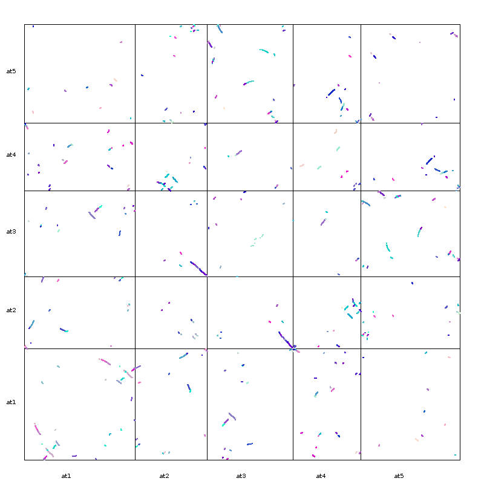
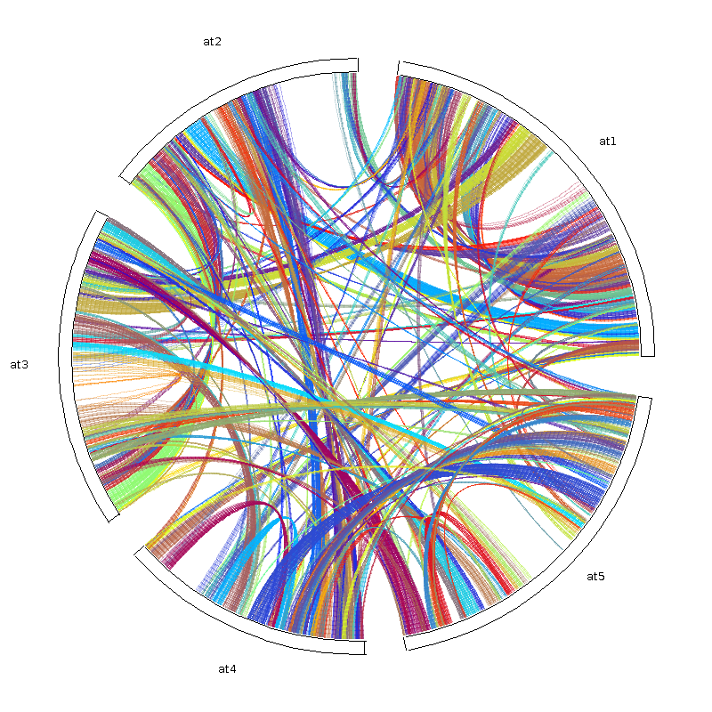

# MCScanX-tutorial
A tutorial on how to use MCScanX as decribed in the paper:
Wang, Y., Tang, H., Debarry, J. D., Tan, X., Li, J., Wang, X., Lee, T. H., Jin, H., Marler, B., Guo, H., Kissinger, J. C., & Paterson, A. H. (2012). MCScanX: a toolkit for detection and evolutionary analysis of gene synteny and collinearity. Nucleic acids research, 40(7), e49. https://doi.org/10.1093/nar/gkr1293

Note: the URL, http://chibba.pgml.uga.edu/mcscan2 is not maintained anymore. The updated source and documentation for this program can be found here: https://github.com/wyp1125/MCScanX

## Installation 
Installation is pretty simple, follow the steps (after logging into the cluster and in an interactive session):

```
git clone https://github.com/wyp1125/MCScanX.git
cd MCScanX
make
```

## Prepare data

For this tutorial I will try to find synteny within the _Physcomitrium patens_ genome. The only files required for this analysis are a blast output (BLASTP output of m8 format) file and a "gff/bed" file. The gff is in quotes because the format here is quite unique. 

Format for blast output:
```
AT1G50920   AT1G50920    100.00  671     0       0       1       671     1       671     0.0     1316
```
Format for the gff file:

```
Chr     Gene            Start   End
at1     AT1G01010       3631    5899
at1     AT1G01020       5928    8737
at1     AT1G01030       11649   13714
at1     AT1G01040       23146   31227
at1     AT1G01050       31170   33153
at1     AT1G01060       33379   37840
at1     AT1G01070       38752   40944
```

NOTE: 
- You must have protein sequences for analysis. It is not advisable to perform a tblastx analysis, because the gene IDs are really for the analysis. 
- Save the files with a two letter representation of the species. For eg, for Arabidopsis thaliana, you would save the file as at.gff and at.blast
- Save these files in a folder named after the two letter representation of the species. So the directory name will also be 'at'

Command to prepare blast output:
```
makeblastdb -in at.fa -dbtype prot -parse_seqids
blastp -query at.fa -db all -out at.blast -evalue 1e-10 -num_threads 16 -outfmt 8 -num_alignments 5
```
NOTE:
- In the original tutorial, https://github.com/wyp1125/MCScanX, they refer to using blastall, which has ben deprecated. Use the latest version of blast, and use blastp instead
- Make sure the output format is set to 8!


## Synteny analysis

The command for this step is very straightforward. To generate the synteny analysis, move out of the directory created for the species of interest:
```
{path_to_MCScanX_dir}/MCScanX dir/xyz
```
This will generate a html directory file and a collinearity file.

There are other downstream analyses also available:
1. duplicate_gene_classifier- classifies the type of duplicate gene[0: singleton (non-repetitive gene) 1: dispersed (not other repeats of 2, 3, 4) 2: proximal (duplication near the chromosome, but not adjacent) 3: tandem (tandem repeat) 4: WGD/ segmental (collinearity gene in the collinearity region)]
2. dissect_multiple_alignment
3. group_collinear_genes

## Synteny visualisation

There are many options, but for this tutorial, I've used the dot_plotter and circle_plotter visualisations.

### Dot plotter

The first step is to create the dot.ctl file. A sample file is already available once you install the program, and you would have to change the chromosome names:
```
800     //dimension (in pixels) of x axis
800     //dimension (in pixels) of y axis
at1,at2,at3,at4,at5     //chromosomes in x axis
at5,at4,at3,at2,at1     //chromosomes in y axis
```
NOTE: Make sure that there are no spaces between chromosome names

To run the visualisation, first copy the java class to the working directory
```
cp {path_to_MCScanX_dir}/downstream_analysis/dot_plotter.class {$PWD}
```
And then, run the java script
```
java dot_plotter -g gff_file -s synteny_file -c control_file -o output_PNG_file
```
in our example,
```
java dot_plotter -g at.gff -s at.collinearity -c dot.ctl -o dot.png
```

Output: 



### Circle plotter

Similarly, there is a circle.ctl:
```
800     //plot width and height (in pixels)
at1,at2,at3,at4,at5     //chromosomes in the circle
```
And you'll have to copy two java classes for this visualisation:
```
cp {path_to_MCScanX_dir}/downstream_analysis/circle_plotter.class {$PWD}
cp {path_to_MCScanX_dir}/downstream_analysis/Cubic.class {$PWD}
```
Run the visualisation:
```
java circle_plotter -g gff_file -s synteny_file -c control_file -o output_PNG_file
```

Output:


